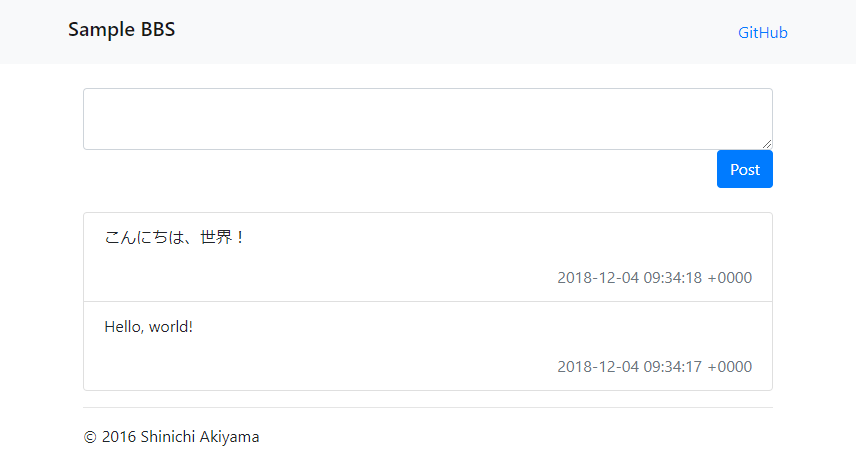

bbs
===

[](https://app.wercker.com/project/byKey/c84b0804ef5cd0d15647571ae538129c)
[](https://codeclimate.com/github/shakiyam/bbs/maintainability)
[](https://snyk.io/test/github/shakiyam/bbs)

Tiny BBS for sample

Requirement
-----------

Docker and Docker Compose

How to run
----------

Edit sample.env and rename it to .env. Then, execute the following commands.

```console
docker-compose up -d
```

View at: <http://localhost:4567/>



Author
------

[Shinichi Akiyama](https://github.com/shakiyam)

License
-------

[MIT License](https://opensource.org/licenses/mit)
